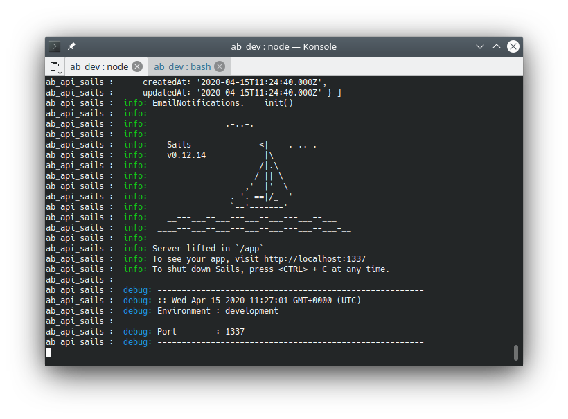

<!-- 

 -->



## Preparation

### Installing Docker



1. Create a docker account at [https://www.docker.com/](https://www.docker.com/)
1. Install docker client for your OS
   - [Linux (Ubuntu-based distributions) use docker’s repository](https://docs.docker.com/engine/install/ubuntu/)
   - [Windows (using WSL2)](https://docs.docker.com/docker-for-windows/wsl/)  
     
     These instructions work from Windows, no need to run within a Linux shell. The other steps are already included above
     - - Install wsl, update wsl to version two, create unix user
     - - Make docker account/ install docker
     - - VSCode + 'Remote - WSL extension.'
     - - Install Windows Terminal, run all future commands in Linux shell
         
   - [Mac](https://docs.docker.com/docker-for-mac/install/)
1. Create a docker swarm:
   ```bash
   docker swarm init --advertise-addr {my.ip.addr.ess}
   ```

**NOTE:** Some useful docker commands:

```bash
docker stack deploy -C {file} {stack}
docker stack remove {stack}
docker ps
docker stats
docker stack ls
docker container ls
docker network ls
docker volume ls
docker images
docker image pull
docker system prune
```

### Installing node.js and NPM



It is recommended to use a node version manager to install node.js & npm. Two well- known version managers are [nvm](https://github.com/nvm-sh/nvm#node-version-manager---) and [n](https://github.com/tj/n#n--interactively-manage-your-nodejs-versions). These managers allow you to install multiple versions of node/npm, to switch between them easily, and to avoid “global installs” (which would necessitate sudo/root access).

#### Linux, Mac:

First, run the nvm install script from the link above (curl or wget). Afterward, you may have to configure your current shell environment:

```bash
bash source ~/.bashrc
```

Execute the following command, to install both node and npm:

```bash
nvm install node
```

Alternatives (nodesource) to using a node version manager:

[Downloading and installing Node.js and npm](https://docs.npmjs.com/downloading-and-installing-node-js-and-npm)

#### Windows:

See [nvm-windows](https://github.com/coreybutler/nvm-windows)

## Install the AppBuilder

The ab-cli tool is the primary tool that creates either a production instance, or a developer install of the AppBuilder. Install the installer using the following command:

```bash
npm install -g digi-serve/ab-cli
```

Then, run the installer. Specify your own target directory in place of `{install_dir}`, (note that specifying a pre-existing directory may cause problems) for example:

```bash
appbuilder install {install_dir} --develop
```

**Option Definitions**

- `--develop`: executes git clone commands to bring down the source code
- `--V1`: use this flag to install AppBuilder version 1

**Recommended Settings**

This installer will ask the following prompts.

```plaintext
? What Docker Stack reference do you want this install to use: ab
? What port do you want AppBuilder to listen on (80): 8080
? Do you want to expose the DB : Yes
? What port do you want the DB to listen on: 3306
? Which Docker Tags to use [master, develop]: develop
? Use nginx as a proxy server? Yes
? What kind of SSL encryption do you want: none
? Enter the password for the DB Root User? root
? Do you want to encrypt the DB tables on disk? No
? Do you want to connect to a Slack channel for updates? No
? Do you want to enable SMTP Email Notifications? : No
? Enter the Tenant Administrator Username: admin
? Enter the Tenant Administrator password: admin
? Enter the Tenant Administrator email: admin@email.com
```



## Starting AppBuilder

Start webpack:

```bash
cd {install_dir}/developer/ab_platform_web
npm run watch
```

In a second terminal run UP.sh

```bash
cd {install_dir}
./UP.sh
```

When you see the following screen, it means that the AppBuilder stack has successfully loaded.
\
In a browser open:

[`http://127.0.0.1:{port_number}`](http://127.0.0.1)

## Additional Information

If using `--develop flag`, the various code repositories will be located at: `{install_dir}/developer/`

To monitor and publish code changes automatically:

```bash
cd {install_dir}/developer/app_builder
npm run watch
```

## Files That You Should Know About

Docker production environment configuration file: `{install_dir}/docker-compose.yml`

Docker development environment configuration file: `{install_dir}/docker-compose.dev.yml`

Convenient helper - bring up all AppBuilder Docker services: `{install_dir}/UP.sh`

Convenient helper - shut down all AppBuilder Docker services: `{install_dir}/Down.sh`

Convenient helper - restart a single AppBuilder Docker service: `{install_dir}/restart.sh {docker_service_name}`

Convenient helper - enter a docker shell session: `{install_dir}/cli.sh`
