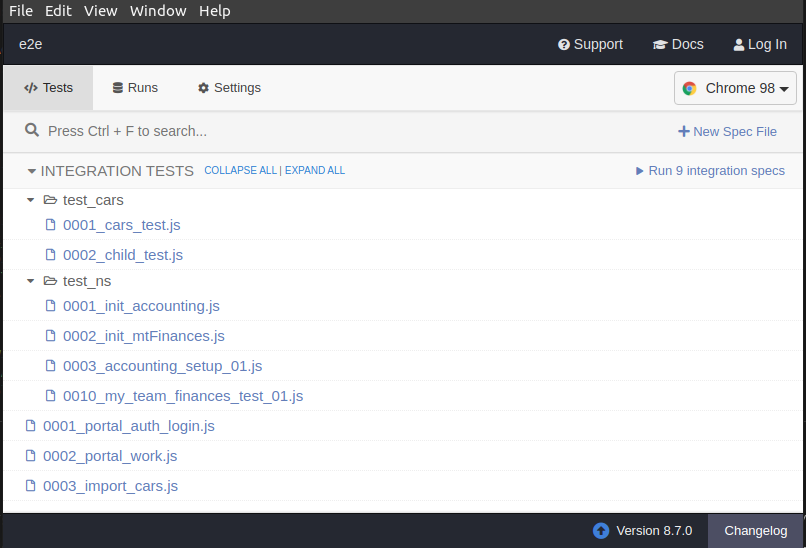
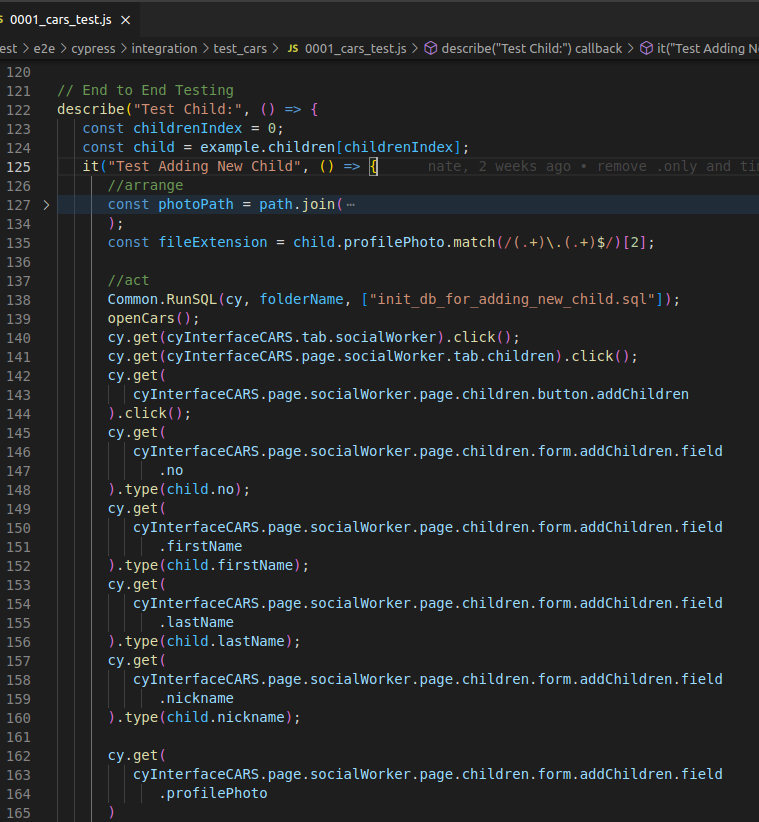
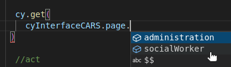

To set up our Cypress E2E test environment use the AppBuilder Installer to [setup a development environment](../../setup/Setup.md).

### Zero-to-tester checklist

Install:
Get [docker](https://docs.docker.com/get-docker/), nvm(node.js), npm, and a [git version manager ](https://www.sourcetreeapp.com/)
use the AppBuilder Installer to [setup a development environment](../../setup/Setup.md).
Use git version manager to [clone](https://confluence.atlassian.com/get-started-with-sourcetree/clone-a-remote-repository-847359098.html) the module-repo you want to make tests for (ex: ns_app)
Use:
Open your AB install folder in your IDE
Open command line (one inside VScode works great)
If appbuilder is fully installed these will start the **test server** and **the test-chrome-window**
$`npm run test:boot`
$`npm run cypress:open`
Clicking one of these will run that test, all the top level tests are a good way to make sure your local envirment is working

You can open localhost:8088 or 127.0.0.1:8088 in your browser. (useful for getting data-cy ids)

There are two places you will spend your time working:
The logic: what buttons are clicked, typed in, and checked to see if data saved properly

The interface: this JSON is what is accessed by the 'cyInterfaceCARS' in the logic.

(VScode will prompt you with a variable on the logic side if it exists in the structure)

## Scripts

Use `npm test` to start the docker test stack and run the tests in a headless browser. The docker stack will remain up so you rerun the tests using `npm test`.

Use `npm run cypress:open` to open the Cypress Test Runner. This allows you to run a test and watch it. This is recommended when writing or debugging a test. This requires the docker test stack to be running. Use `npm test` or `npm run test:boot` first.

Use `npm run test:down` to remove the docker test stack.

## Folder Structure

New tests can be added to `test\e2e\cypress\integration`. See [writing tests](../writeTests/WriteTests.md).

## Reference

### Test Ports

| Port | Container  |
| ---- | ---------- |
| 8088 | AppBuilder |
| 8889 | Database   |
