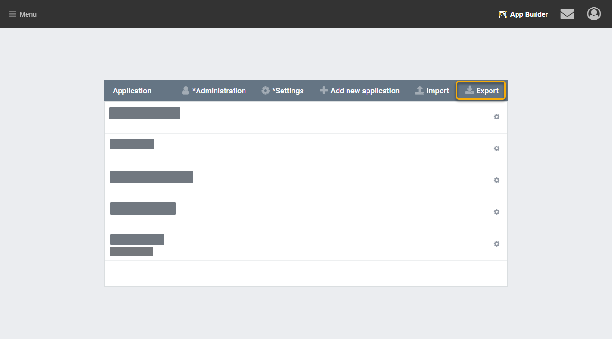
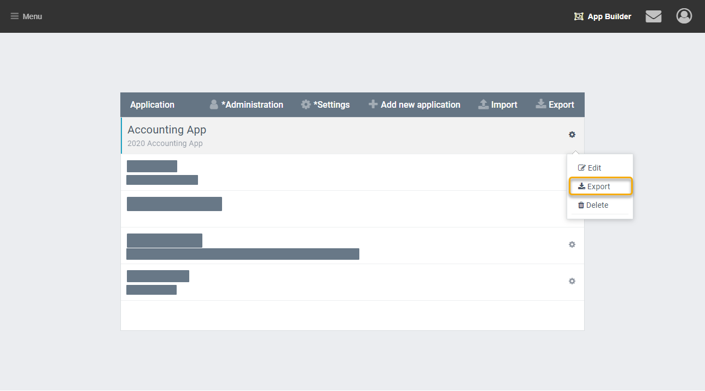
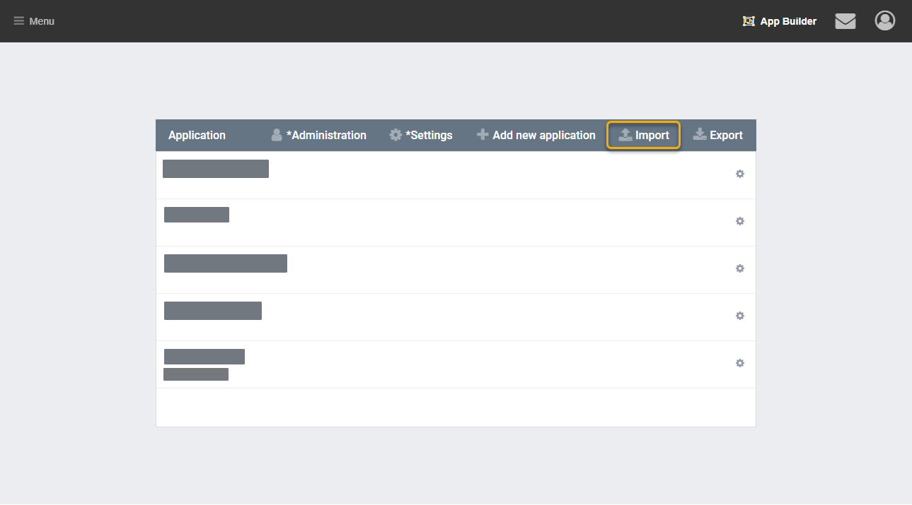

App definitions can be exported and imported. This allows apps to be shared to other servers, and can be a way of backing up work.

## Exporting

There are two ways to export.

### Exporting All Apps

This is recommended in most cases. Files exported in this method are referred to as `appbuilder.json`. The `appbuilder.json` includes all apps in the given AppBuilder Instance.

From AppBuilder select the Export Button in the menu to download the `appbuilder.json` file.

### Exporting Individual Apps

Alternatively a Single App can be exported (here referred to as `app.json`).
From AppBuilder select the cog beside your app. Then click export from the menu.

## Importing

Importing works the same regardless of the export method. Click Import from the menu bar in AppBuilder. Then select an `appbuilder.json` or `app.json` file to upload. After importing the server needs to be restarted.

## Cautions

- Because Objects can be shared between multiple apps, importing a single app can still impact other apps.
- Changes made on the current server may be lost after importing the same app with new changes on another server.
- Roles and Scopes are not included in the export/import. This may cause your app to look broken. Updating Access Management and Permissions will fix this. Roles and Scope can be imported and exported with another tool, which should resolve things as well.

### Test an Import

This is the recommended procedure to test an import:

On a new AppBuilder instance:

1. Import the `appbuilder.json` from the server where you want to import to.
2. Import the `app.json` or `appbuilder.json` that you want to import.
3. Verify things work as expected.
