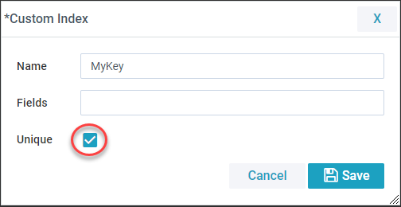
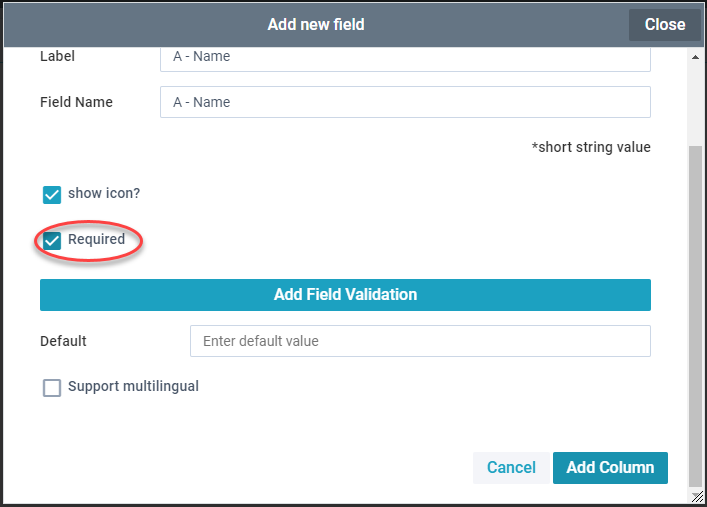

## Instructions

To connect an object using a Custom Foreign Key first you need to create a valid index. Click add Index then fill out the details, including the name of the index, the field(s) to use to create the index and whether it is a unique value or not.

Only unique index are valid for use in a connected record field. Also the field used in the index needs to be a required field (set this in it's field properties).

After creating a valid index the option 'use custom foreign key' is available when add a connected record field.

## Which Object's Key is Used

| Connection Type | Uses A's Custom Index | Use's B's Custom Index |
|-----------------|-----------------------|------------------------|
| Many A - Many B | x                     | x                      |
| Many A - One B  |                       | x                      |
| One A - Many B  | x                     |                        |
| One A - One B   |                       | x                      |
